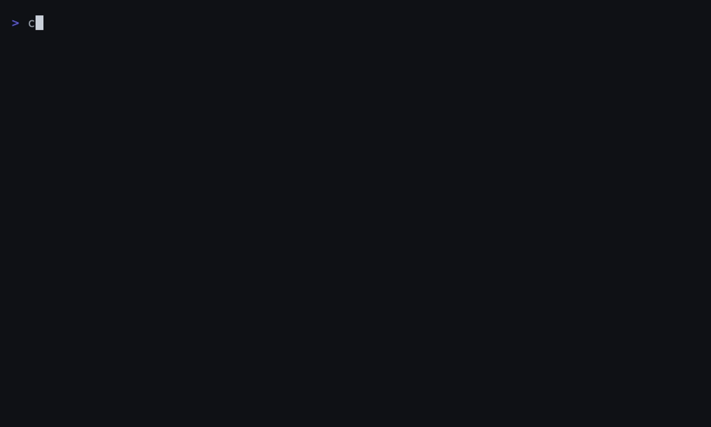

<div align="center">

# crasec

**Turn a repository into signed, auditor-ready EU Cyber Resilience Act evidence — SBOM, VEX, CSAF advisory, Annex VII technical file, and EU Declaration of Conformity — with one CLI.**

[](https://github.com/getcrasec/crasec/actions/workflows/ci.yml)
[](https://goreportcard.com/report/github.com/getcrasec/crasec)
[](https://github.com/getcrasec/crasec/releases)
[](LICENSE)

**CRA Article 14 vulnerability-reporting obligations become enforceable on 11 September 2026.** If your product ships into the EU, that's not a distant compliance deadline — it's the date you need a working pipeline from "we found a CVE" to "ENISA has been notified within 24 hours," with the paper trail to prove it.

</div>

---

## See it in 90 seconds



`crasec init` detects your project, `sbom generate` produces a CycloneDX SBOM, `vuln correlate` scores every finding for CRA relevance (CVSS × KEV × EPSS), and `bundle export` assembles the signed evidence ZIP. Every artifact in the recording is real — see [`demo/`](demo/) to record your own.

---

## Get started in 10 minutes

```sh
# Install
go install github.com/getcrasec/crasec@latest
# or download a prebuilt binary: https://github.com/getcrasec/crasec/releases

# From your project's root
crasec init                                    # guided setup: detects ecosystem, writes .crasec.yaml
crasec sbom generate -o sbom.cdx.json          # CycloneDX 1.6 SBOM (syft, +cdxgen if installed)
crasec sbom validate sbom.cdx.json             # BSI TR-03183-2 compliance score, 0-100%
crasec vuln correlate --sbom sbom.cdx.json --osv-scanner=false -o findings.json   # Grype, scored for CRA relevance
```

Grype (a Go library, no separate install) is enough to get scored findings above. Add broader coverage — Go modules, Python, Rust, and distro advisories OSV.dev often has that Grype's NVD-based database misses — with `go install github.com/google/osv-scanner/cmd/osv-scanner@latest` and dropping `--osv-scanner=false`.

`vuln correlate` against a real project looks like this (Apache Struts 2.3.20 — yes, that CVE-2017-5638):

```
found 142 vulnerability matches
15 CRA-CRITICAL — Article 14 report required within 24h

VULNERABILITY     PACKAGE                           CVSS  KEV  EPSS  CRA SCORE  CATEGORY
CVE-2017-5638     struts2-core@2.3.20               10.0  YES  1.00  30.00      CRA-CRITICAL (ARTICLE 14)
CVE-2020-17530    struts2-core@2.3.20               9.8   YES  0.96  29.40      CRA-CRITICAL (ARTICLE 14)
CVE-2022-22965    spring-beans@3.0.5.RELEASE        9.8   YES  1.00  29.40      CRA-CRITICAL (ARTICLE 14)
...
```

```
CRA Score = CVSS Base Score × KEV Multiplier × EPSS Weight
  KEV Multiplier: 2.0 if actively exploited (in CISA KEV), else 1.0
  EPSS Weight:    1.5 if 30-day exploitation probability > 0.7, else 1.0
  > 14 → CRA-CRITICAL: Article 14 trigger, report to ENISA within 24h
```

That gets you a scored, prioritized vulnerability list — the fast feedback loop you'll run on every PR. The full evidence bundle (what an auditor actually asks for) needs a few more artifacts, each satisfying a specific CRA requirement:

```sh
crasec vex generate --sbom sbom.cdx.json --findings findings.json --from-file vex-decisions.yaml
crasec csaf generate --sbom sbom.cdx.json --findings findings.json \
  --tracking-id CRASEC-2026-0001 --title "Security advisory for myapp" \
  --publisher-name "Acme Corp" --publisher-namespace https://acme.example
crasec annex7 scaffold --product myapp              # guided wizard — 10 required sections
crasec annex7 export --input annex7-myapp.json -o annex7.pdf
crasec doc generate --product myapp --annex7 annex7-myapp.json \
  --manufacturer-name "Acme Corp" --manufacturer-address "1 Rue de la Paix, 75002 Paris, France" \
  --signatory-name "Jane Doe" --signatory-function CTO --signatory-place Paris --sign

crasec sbom sign sbom.cdx.json && crasec vex sign vex.cdx.json && crasec csaf sign advisory.json
crasec bundle export --product myapp -o evidence-bundle.zip
```

Every signature above uses [Sigstore](https://www.sigstore.dev/) keyless signing: a browser OIDC login locally, or your CI's ambient identity token — no key management. `bundle export` refuses to write a partial ZIP; if anything's missing it lists exactly which artifact and the command that produces it.

---

## GitHub Actions

Signing needs no secrets in CI — Sigstore trusts the workflow's own OIDC token.

```yaml
name: CRA compliance

on:
  pull_request:
  push:
    branches: [main]

permissions:
  id-token: write   # required for Sigstore keyless signing
  contents: read

jobs:
  compliance:
    runs-on: ubuntu-latest
    steps:
      - uses: actions/checkout@v5

      - name: Install crasec and osv-scanner
        run: |
          go install github.com/getcrasec/crasec@latest
          go install github.com/google/osv-scanner/cmd/osv-scanner@latest

      - name: Generate and sign SBOM
        run: |
          crasec sbom generate --target . -o sbom.cdx.json
          crasec sbom sign sbom.cdx.json

      - name: Correlate vulnerabilities and gate on CRA-CRITICAL findings
        run: crasec vuln correlate --sbom sbom.cdx.json -o findings.json

      - name: Generate and sign VEX
        run: |
          crasec vex generate --sbom sbom.cdx.json --findings findings.json \
            --from-file vex-decisions.yaml -o vex.cdx.json
          crasec vex sign vex.cdx.json

      - name: Generate and sign CSAF advisory
        run: |
          crasec csaf generate --sbom sbom.cdx.json --findings findings.json \
            --tracking-id CRASEC-${{ github.run_number }} \
            --title "Security advisory for ${{ github.repository }}" \
            --publisher-name "Acme Corp" --publisher-namespace https://acme.example \
            -o advisory.json
          crasec csaf sign advisory.json

      - name: Enforce BSI TR-03183-2 SBOM quality gate
        run: crasec sbom validate sbom.cdx.json --min-score 80

      - uses: actions/upload-artifact@v5
        with:
          name: cra-evidence
          path: |
            sbom.cdx.json
            sbom.cdx.json.sig
            vex.cdx.json
            vex.cdx.json.sig
            advisory.json
            advisory.json.sig
```

Annex VII and the EU Declaration of Conformity are produced once per release (they change on a product-decision cadence, not per-commit) and folded in with `crasec bundle export` before the release job runs.

---

## What crasec produces

| Artifact | CRA requirement it satisfies |
|---|---|
| `sbom.cdx.json` | Annex I, Part II, §1 — Software Bill of Materials |
| `vex.cdx.json` | Annex I, Part II, §2 — Vulnerability handling (exploitability assessment) |
| `csaf-advisory.json` | Article 14 — Vulnerability reporting / public disclosure (ENISA-recommended CSAF format) |
| `annex7.json` / `annex7.pdf` | Annex VII — Technical documentation (machine-readable / human-readable) |
| `eu-doc.json` / `eu-doc.pdf` | Annex V — EU Declaration of Conformity (machine-readable / signed copy for CE marking) |
| `*.sig` (every artifact above) | Integrity signature — Sigstore keyless signing, recorded in Rekor's transparency log |

`crasec bundle export` assembles all of the above into one ZIP with `manifest.json` (SHA-256 + generation timestamp + CRA requirement for every file) and a plain-language `README.txt` — handed to an auditor or market-surveillance authority as-is.

---

## BSI TR-03183-2 compliance

`crasec sbom validate` scores a CycloneDX SBOM against all 10 fields BSI TR-03183-2 v2.1.0 (§3.2.9, §5.2.2, §5.2.4, §6.1) requires per component — creator, name, version, filename, SHA-512 hash, PURL, dependencies, license, supplier, description — each cross-referenced to CRA Annex I, Part II, §1(a). The result is a single 0–100% score with a per-field breakdown:

```
Per-field population:
  name            ████████████████████  52/52  (100.0%)
  version         ███████████████████░  50/52  (96.2%)
  purl            ███████████████████░  50/52  (96.2%)
  dependencies    █████░░░░░░░░░░░░░░░  15/52  (28.8%)
  creator         ░░░░░░░░░░░░░░░░░░░░  0/52   (0.0%)

BSI TR-03183-2 compliance score: 41.7%
Result: 41.7%  (add --strict or --min-score N for CI gating)
```

BSI TR-03183-2 is the technical guideline German and EU regulators point to for "what does a CRA-compliant SBOM actually contain" — `--min-score` turns that into a CI gate instead of a manual audit checklist.

---

## Community, contributing, and license

- **Contributing:** see [CONTRIBUTING.md](CONTRIBUTING.md) for the build/test/lint workflow and how to sanity-check ecosystem-specific changes against real projects.
- **Code of conduct:** [Contributor Covenant v2.1](CODE_OF_CONDUCT.md).
- **Issues & discussion:** [GitHub Issues](https://github.com/getcrasec/crasec/issues).
- **License:** [Apache License 2.0](LICENSE).

crasec is not a law firm and this isn't legal advice — it automates the evidence-generation mechanics of CRA compliance (SBOM, VEX, CSAF, Annex VII, Annex V), not the legal judgment calls (product classification, conformity assessment route) that stay yours to make.
